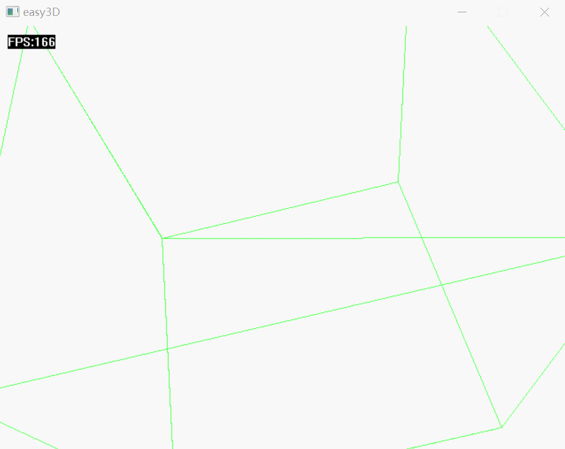

# Easy3D

## 类

### 光栅化 Rasteration

类内部定义虚拟显示缓冲，用于给设备显示，并提供了简单的画线和填充三角形的函数

```c++
class Rasteration {
    public:
    Rasteration(int width, int height);
    ~Rasteration();

    // 使用指定颜色清空
    void clear(COLORREF color = 0);
    // 画线
    void drawLine(double x1, double y1, double x2, double y2, COLORREF color = 0xffffff);
    // 填充三角形
    void drawFillTriangle(double x1_, double y1_, double x2_, double y2_, double x3_, double y3_, COLORREF color = 0xffffff);
    // 返回显示缓冲
    const DWORD* getBuffer();

    private:
    void __writePixel(int x, int y, COLORREF color);
    void __toDisplayCoord(double x, double y, double& _x, double& _y);

    private:
    int __width;
    int __height;
    int __size;
    COLORREF* __buffer;   // 虚拟显示缓冲
};
```

### 显示设备 GraphicsDevice

用于将光栅化的缓冲数据显示在设备上，这里使用 [easyx](easyx.cn) 的`DWORD* GetImageBuffer(IMAGE* pImg = NULL);`直接操作设备显示缓冲

```c++
// 显示设备
class GraphicsDevice {
public:
    GraphicsDevice(int width, int height);
    ~GraphicsDevice();
    
    // 显示光栅化结果
    void displayRaster(const DWORD* buffer);
    // 显示帧率
    void outFPS(uint fps);
    // 刷新画面
    void flush();
private:
    // 显示区域的数据缓冲
    DWORD* __display_buffer;
    // 显示区的大小
    int __width;
    int __height;
    int __size;
};
```

### 变换矩阵 Transform

定义一些必要的变换矩阵

```c++
class Transform {
public:
    // 旋转
    static TransformMat rotate(Point3 axis, double angle);
    // 平移
    static TransformMat translate(double dlt_x, double dlt_y, double dlt_z);
    // 缩放
    static TransformMat scale(double s_x, double s_y, double s_z);

    // 世界坐标系 -> 视景坐标系
    static TransformMat camera(Point3 eye, Vector3 center, Vector3 up);
    // 平截头体拉伸矩阵
    static TransformMat perspective();
    // 由重映射确定的正交投影矩阵，归一化坐标，将平截头体变为-1~1正方体
    // angle 垂直视张角 
    // aspect 横纵比
    // z_near z_far 近远平面
    static TransformMat orth_uniform(double angle, double aspect, double z_near, double z_far);
};
```

### 裁剪 Clip

实现了线段裁剪：区域编码简单的排斥接受，Cyrus-Beck裁剪XY平面，最后对Z轴裁剪

```c++
class Clip {
public:
    static std::vector<Point3> clip(const std::vector<Point4>& points, Primitive type);
private:
    // 线段剪裁
    static std::vector<Point3> __clipLine(const std::vector<Point4> &points);
    // 获取二维区域编码
    static unsigned char __getRegionCode(Point2 p);
    // Cyrus Beck 编码裁剪线段 对XY平面就行裁剪
    static bool __Cyrus_Beck(Point3& p0, Point3& p1);
    // XY平面裁剪后对Z轴裁剪
    static bool __z_clip(Point3& p0, Point3& p1);

};
```

## 展示

### example0

> 立方体的投影以及裁剪，见example0.cpp

